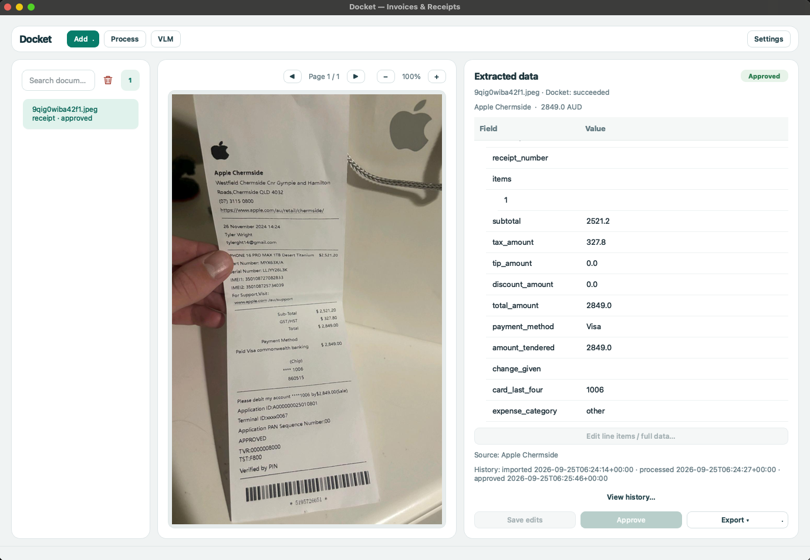

# docket — Python library for invoice, receipt and contract OCR extraction with LLMs

Extract cited, validated JSON from scanned invoices, receipts and contracts. Export EU e-invoices checked against official rules.

```bash
pip install docket-idp
```



Python library + CLI · Ollama or OpenAI-compatible API · Apache-2.0

---

## Quick start

With Tesseract and [Ollama](https://ollama.com) or an OpenAI-compatible API configured (see [Requirements](#requirements) and [Configuration](#configuration)):

```bash
docket process invoice.pdf        # JSON on stdout; exit 2 if validation fails
```

```json
{
  "status": "succeeded",
  "document_type": "invoice",
  "extracted": {"invoice_number": "FAC-2026-0042", "issue_date": "2026-03-15", "total_amount": 1493.82, "currency": "EUR"},
  "field_sources": {"total_amount": {"page": 1, "quote": "Total factura: 1.493,82 €", "bbox": {"x0": 0.62, "y0": 0.71, "x1": 0.89, "y1": 0.73}}}
}
```

## Extract invoice data in your Python application

```python
from docket import ExportError, OcrOptions, ProcessOptions, export_document, process_document

options = ProcessOptions(document_type="invoice", ocr=OcrOptions(backend="tesseract", fallbacks=["vlm"]))
result = process_document("invoice.pdf", options)
try:
    xml = export_document(result, "xrechnung-ubl").content   # refuses invalid or unreviewed results
except ExportError:
    print(result.status, result.review_reasons)
```

`result.document` is typed (`Invoice`, `Receipt`, `Contract`, …); `result.status` is `succeeded`, `needs_review` or `failed`; and `result.field_sources` holds page, quote and box. Processing writes nothing unless requested. For directories, use `process_batch("scans/", options, BatchOptions(workers=4, checkpoint="run.jsonl"))` or `docket batch scans/ --format csv --output results.csv`. Batch processing preserves input order, isolates failures and resumes from checkpoints.

## Export and validate XRechnung, Factur-X and Peppol e-invoices

| Format | Name | Checked against |
|---|---|---|
| UBL 2.1 / Peppol BIS 3.0 | `ubl`, `peppol` | EN 16931 (+ Peppol BIS 3.0.20) |
| XRechnung 3.0, UBL / CII | `xrechnung-ubl`, `xrechnung-cii` | EN 16931 + XRechnung 3.0.2 |
| Factur-X / ZUGFeRD CII | `factur-x-en16931`, `factur-x-basic` | Factur-X 1.09 profile rules |
| Facturae 3.2.2 (Spain) | `facturae` | — |

```bash
pip install "docket-idp[einvoice]"
docket einvoice fetch                              # once: Peppol, CII and Factur-X rules are not shipped
docket process invoice.pdf --export xrechnung-ubl --validate-export
docket validate-einvoice invoice.xml               # XSD + Schematron; exit 0 valid, 2 invalid, 3 not set up
docket factur-x create invoice.pdf factur-x.xml -o hybrid.pdf
```

Converting a supplier invoice produces EN 16931 data for your books, not a legally issued e-invoice from that supplier.

For data extracted elsewhere, `verify(data, page_texts, document_type="invoice")` checks citations, numbers, dates, arithmetic and check digits, returning a `DocumentResult` subject to the same export rules. Direct schema exports also check arithmetic, dates and check digits.

Exporters reject missing line items or inconsistent tax instead of guessing. Offline validation uses official artifacts pinned in the [manifest](https://github.com/KazKozDev/docket/blob/master/src/docket/einvoice/resources/manifest.json); those without verified redistribution terms are downloaded on request ([licence inventory](https://github.com/KazKozDev/docket/blob/master/docs/THIRD_PARTY_LICENSES.md)). Python APIs include `validate_einvoice()`, `generate_facturx_pdf()` and `verify_facturx_round_trip()`.

## Add custom document types and vendor templates

`docket schemas list` shows seven versioned accounts-payable schemas: invoice, purchase order, receipt, contract, bank statement, waybill and experimental credit note. Add one with a Pydantic model:

```python
from datetime import date
from docket import CitedDocument, Party, SchemaSpec, keywords, register_schema

class ParkingTicket(CitedDocument):      # CitedDocument adds page/quote citations
    ticket_number: str
    issuing_authority: Party
    issue_date: date
    fine: float

register_schema(SchemaSpec(
    schema_id="parking_ticket", version="1.0", model=ParkingTicket,
    description="Parking ticket / Strafzettel",
    keywords=keywords("parking ticket", "strafzettel"),
    cited_fields=("ticket_number", "issuing_authority.name", "fine"),
))
```

Registered schemas use the same classification, extraction, citation checks and exports. `register_vendor_template()` reads known layouts without an LLM and still requires validation; `register_exporter()` adds ERP-specific formats. Schemas, exporters and OCR backends can ship as entry-point plugins; see [`examples/`](https://github.com/KazKozDev/docket/blob/master/examples/).

## Measure extraction accuracy on public datasets

The key risk is a wrong result marked `succeeded`. In the latest run, **13 of 66** such results were wrong (20%); excluding SROIE receipts, **3 of 24** were wrong (13%).

Across 195 labelled scans from the golden set and public datasets (DocILE, SROIE, CORD, FUNSD, RVL-CDIP, donut-style invoices), field accuracy was **0.88**; 73% of documents had every field right.

Against pip-installable alternatives, each tool and docket are graded on the same supported documents and fields:

| | docs | tool | docket on the same docs |
|---|---|---|---|
| docpick 0.1.3 | 55 | 0.61 | **0.85** |
| ocrcontext 0.1.5 | 55 | 0.04 | **0.83** |
| invoice2data 1.0.1 | 44 | 0.00 | **0.89** |

Method and per-source results: [docs/BENCHMARKS.md](https://github.com/KazKozDev/docket/blob/master/docs/BENCHMARKS.md).

## How it works

Each page uses its PDF text layer, OCR (Tesseract, PaddleOCR, Docling or a plugin), or a vision model when OCR is unusable. Optional photo cropping, enlargement and `OcrOptions(preprocess=fn)` prepare images. Rules, TF-IDF and then an LLM classify documents; extraction fills a Pydantic schema with source lines. Deterministic checks cover citations, arithmetic, dates and check digits; uncertain results go to review.

```
document → text layer / OCR / VLM → classify → extract + cite → validate → JSON or review
```

## Configuration

Priority: defaults → TOML (`--config` or `DOCKET_CONFIG`) → environment → explicit arguments. The CLI and API also load `.env` and `./docket.toml`; importing the library does not. See [`docket.example.toml`](https://github.com/KazKozDev/docket/blob/master/docket.example.toml) or `docket config show` for effective values and sources.

| Variable | Default | What it does |
|---|---|---|
| `DOCKET_LLM_PROVIDER` | `ollama` | `ollama`, or `openai` for any OpenAI-compatible API |
| `DOCKET_LLM_BASE_URL` / `DOCKET_LLM_API_KEY` | OpenAI / unset | Endpoint and key for `openai`, e.g. `https://api.mistral.ai/v1` |
| `DOCKET_TEXT_MODEL` / `DOCKET_VISION_MODEL` | `deepseek-v4.1-flash:cloud` | Models for extraction and for reading scans |
| `OLLAMA_HOST` | `http://localhost:11434` | Where Ollama is listening |
| `DOCKET_OCR_BACKEND` | `auto` | `tesseract`, `paddle`, `docling`, `auto` or a plugin name |
| `DOCKET_OCR_FALLBACKS` | `vlm` | Backends tried when a page's reading is rejected |
| `DOCKET_OCR_LANGUAGES` | `en` | ISO 639-1 codes, e.g. `en,de,fr` |
| `DOCKET_OCR_CROP_PHOTOS` | `true` | Crop and flatten the document in a photo (needs `[photo]`) |
| `DOCKET_OCR_MIN_TEXT_HEIGHT` | `20` | Tesseract re-reads a page enlarged when words are shorter than this (px); `0` off |
| `DOCKET_MIN_CONFIDENCE` | `0.55` | Classification confidence below which a document goes to review |
| `DOCKET_MIN_SOURCE_CONFIDENCE` | `0.8` | OCR confidence a key field's cited words need, or the document goes to review |
| `DOCKET_REVIEW_QUEUE_ENABLED` | `false` | Persist flagged documents in the review queue (`[review]` extra) |
| `DOCKET_REVIEW_DATABASE_URL` | `sqlite:///data/review.db` | Review store; PostgreSQL with the `[postgres]` extra |
| `DOCKET_BATCH_WORKERS` | `4` | Documents in flight per batch |
| `DOCKET_EINVOICE_DOWNLOADS` | `~/.cache/docket/einvoice` | Where `docket einvoice fetch` stores artifacts |

## Requirements

- Python 3.10+
- Tesseract on PATH (or the `[paddle]` / `[docling]` extra)
- Ollama, or any OpenAI-compatible API (Mistral, OpenAI, Azure, vLLM)
- macOS or Linux; CI runs on Ubuntu

## Limitations

- Wrong `succeeded` results remain possible (see [benchmarks](https://github.com/KazKozDev/docket/blob/master/docs/BENCHMARKS.md)); most came from degraded SROIE receipts. Two thirds of documents go to review, and scanned DocILE invoices are the weakest source (0.43).
- The vision model has been seen changing digits so that a page reconciles.
- Windows is untested. A document takes a median of 6.4–22.7 s depending on the OCR backend (8.7 s on the full corpus with Tesseract), longer with the vision model.

<details>
<summary>Extras, HTTP service, Docker, development</summary>

### Extras

```bash
pip install "docket-idp[api]"       # HTTP service (docket-api)
pip install "docket-idp[einvoice]"  # official e-invoice validation
pip install "docket-idp[review]"    # persistent review queue (SQLAlchemy; [postgres] for PostgreSQL)
pip install "docket-idp[paddle]"    # PaddleOCR backend
pip install "docket-idp[docling]"   # Docling/TableFormer backend
pip install "docket-idp[photo]"     # crop and flatten documents in phone photos (OpenCV)
pip install "docket-idp[all]"       # + Langfuse tracing and e-invoice validation
```

The native invoice and receipt app is in [`apps/desktop`](apps/desktop/): install with `python -m pip install -e . -e apps/desktop`, then run `docket-desktop` ([guide](docs/DESKTOP.md)).

Langfuse tracing starts only when `LANGFUSE_PUBLIC_KEY` and `LANGFUSE_SECRET_KEY` are set, and then records model, latency and sizes. Prompts and answers, which contain the document's text, are sent only with `DOCKET_LANGFUSE_CONTENT=true`.

### HTTP service and Docker

Reference applications on the same library contract, for other languages:

```bash
docker run -p 8000:8000 -e DOCKET_API_KEY=secret ghcr.io/kazkozdev/docket
curl -H "Authorization: Bearer secret" -F file=@invoice.pdf localhost:8000/process
```

Without `DOCKET_API_KEY`, `docket-api` serves only on 127.0.0.1; on any other address it refuses to start unless you pass `--no-auth` (an authenticating proxy in front). `POST /jobs` handles multi-file jobs with CSV/JSONL downloads; the typed contract is [`docs/openapi.json`](https://github.com/KazKozDev/docket/blob/master/docs/openapi.json), with interactive docs at `/docs`.

### Development

```bash
git clone https://github.com/KazKozDev/docket.git && cd docket
python3 -m venv .venv && source .venv/bin/activate && pip install -e ".[dev]"
pytest                                   # no test needs a running LLM
streamlit run examples/streamlit_demo.py # demo UI
```

</details>

---

<div align="center">

 

 [](https://pypi.org/project/docket-idp/) [](https://github.com/KazKozDev/docket/blob/master/LICENSE) [](https://github.com/KazKozDev/docket/actions)

[Contributing](https://github.com/KazKozDev/docket/blob/master/CONTRIBUTING.md) · [Security](https://github.com/KazKozDev/docket/blob/master/docs/SECURITY.md) · [License](https://github.com/KazKozDev/docket/blob/master/LICENSE) · [Architecture](https://github.com/KazKozDev/docket/blob/master/docs/ARCHITECTURE.md) · [API stability](https://github.com/KazKozDev/docket/blob/master/docs/API_STABILITY.md) · [Benchmarks](https://github.com/KazKozDev/docket/blob/master/docs/BENCHMARKS.md) · [Changelog](https://github.com/KazKozDev/docket/blob/master/CHANGELOG.md)

</div>
